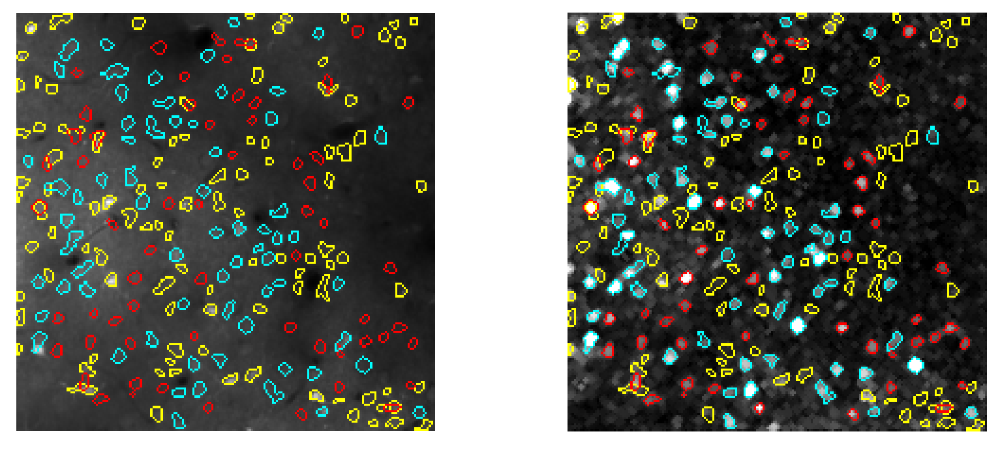

# ImageCN
Convolutional neural networks (CNNs) and fluctuation method–based toolbox (ImageCN) for two-photon calcium imaging data processing
## test Demo example
### Note: matlab 2017b or later is needed
run 'Run_example.m' to process 'demo_movie.tif' that in 'example' folder
You will see outcome like this:
 

